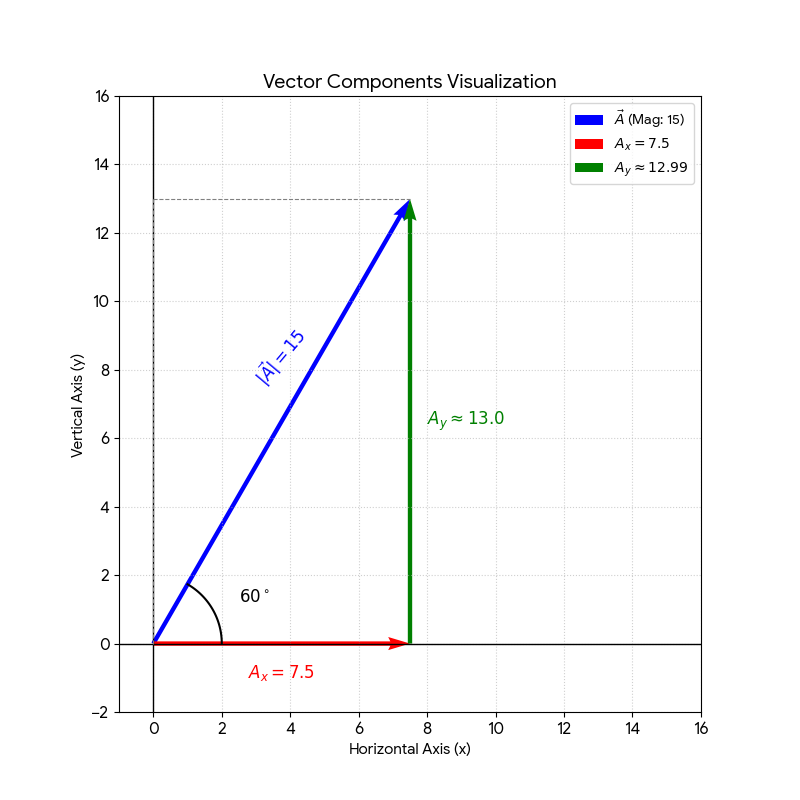

## 5. Trigonometry: Vector Components

Given a vector $\vec{A}$ with:
* **Magnitude:** $|\vec{A}| = 15$
* **Angle:** $\theta = 60^\circ$ (with the horizontal axis)

---

### Component Formulas
To resolve a vector into its horizontal ($A_x$) and vertical ($A_y$) components, we use:
* $A_x = |\vec{A}| \cos(\theta)$
* $A_y = |\vec{A}| \sin(\theta)$

---

### Step 1: Calculate the Horizontal Component ($A_x$)
Using the cosine function:
$$A_x = 15 \cdot \cos(60^\circ)$$
Since $\cos(60^\circ) = 0.5$:
$$A_x = 15 \cdot 0.5 = \mathbf{7.5}$$

### Step 2: Calculate the Vertical Component ($A_y$)
Using the sine function:
$$A_y = 15 \cdot \sin(60^\circ)$$
Since $\sin(60^\circ) = \frac{\sqrt{3}}{2} \approx 0.866$:
$$A_y = 15 \cdot 0.866 \approx \mathbf{12.99}$$

---

### Resulting Vector
In component form, the vector is:
$$\vec{A} = [7.5, 12.99]$$