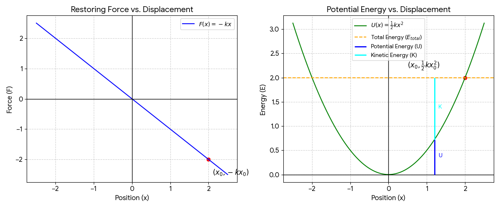

## 8. Work of a Variable Force

#### **1. Equation of Motion and Solution**
Using Newton's Second Law ($F = ma$):
$$m \frac{d^2x}{dt^2} = -kx \implies \frac{d^2x}{dt^2} + \frac{k}{m}x = 0$$

This is a second-order linear differential equation. Let $\omega^2 = \frac{k}{m}$. The general solution is:
**$x(t) = A \cos(\omega t + \phi)$**
Where $A$ is the amplitude and $\phi$ is the phase constant.

#### **2. Calculation of Work ($W$)**
Work is the integral of force over displacement:
$$W = \int_{0}^{x_0} F(x) \, dx = \int_{0}^{x_0} -kx \, dx$$
$$W = \left[ -\frac{1}{2}kx^2 \right]_{0}^{x_0}$$
**$W = -\frac{1}{2}kx_0^2$**

#### **3. Interpretation as Potential Energy ($U$)**
The change in potential energy ($\Delta U$) is defined as the negative of the work done by a conservative force:
$$\Delta U = -W$$
Assuming $U(0) = 0$:
**$U(x) = \frac{1}{2}kx^2$**

#### **4. Verification of $F = -\frac{dU}{dx}$**
Take the negative derivative of the potential energy function:
$$-\frac{d}{dx} \left( \frac{1}{2}kx^2 \right) = -( \frac{1}{2} \cdot k \cdot 2x )$$
**$F = -kx$**
The relationship is verified.

#### **5. Graphs of $F(x)$ and $U(x)$**
* **$F(x) = -kx$:** A straight line passing through the origin $(0,0)$ with a negative slope $-k$. It exists in the 2nd and 4th quadrants.
* **$U(x) = \frac{1}{2}kx^2$:** A parabola opening upwards with its vertex at the origin $(0,0)$. It is symmetric about the y-axis.

